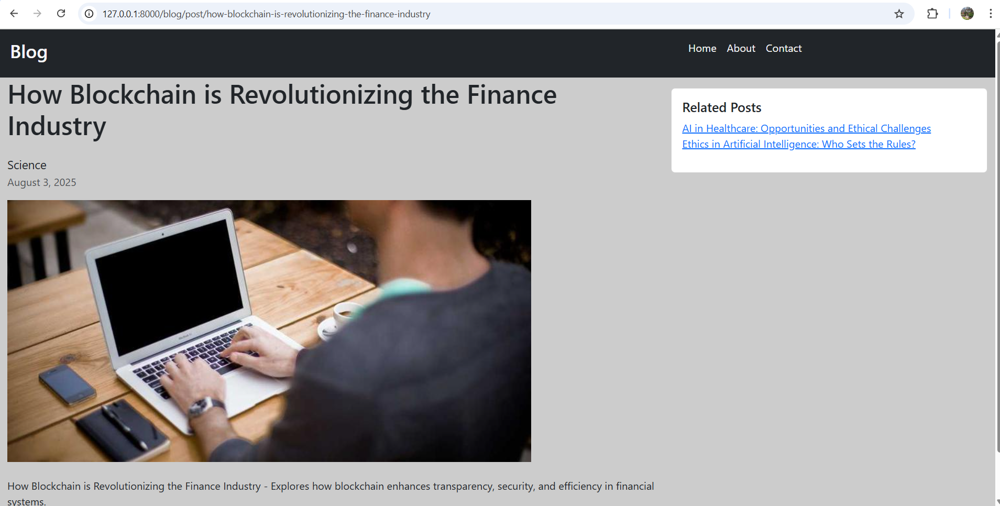
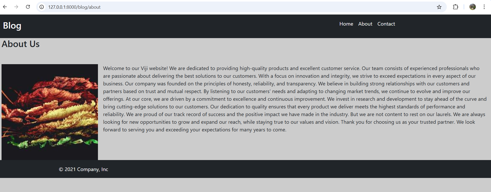
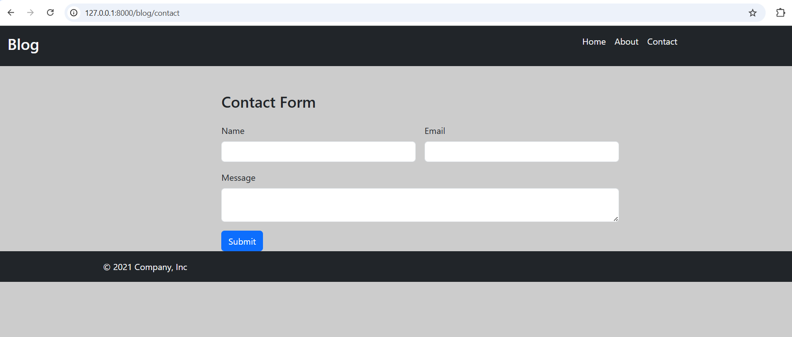

# 📝 Django Blog Project

A fully functional **Blog Web Application** built with **Django** and **MySQL**, featuring pagination, post detail pages with images, and static pages like "About Us" and "Contact".  

---

## 🚀 Features
- **Homepage** displaying all blog posts with pagination
- **Post detail view** with full content and images
- **About Us** and **Contact** pages
- Responsive design using Bootstrap
- Easy-to-use Django admin panel for managing posts
- Integrated with **MySQL** database using MySQL Workbench

---

## 🖥️ Tech Stack
- **Backend:** Django, Python
- **Frontend:** HTML, CSS, Bootstrap
- **Database:** MySQL (via MySQL Workbench)


---

## 📸 Screenshots
## Screenshots

### Home Page


### Blog Post Detail


### About Us


### Contact Page


### Admin Panel


---

## ⚙️ Installation & Setup

### 1️⃣ Clone the repository
```bash
git clone https://github.com/vijayashree809/django_project.git
cd django_project
